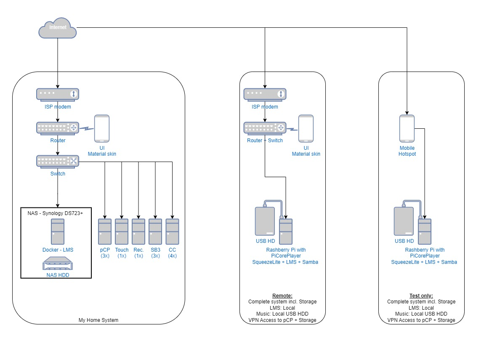

# LmsSynologyPcpRsync - ReadMe

## Description of the motivation for the project:

## System Description:
Principle diagram.  

* **Home System:** Hardware / Software  
<u>NAS:</u> Synology DS723+ / DSM 7.2.1-69057 Update 5  
<u>Router:</u> TP-Link Archer AX50 v1.0 / 1.0.14 Build 20240108 rel.42655(4555)  
<u>LMS:</u> Docker on Synology / Image: lmscommunity/lyrionmusicserver:dev

* **Remote System:** Hardware / Software    
<u>LMS/Player:</u> Raspberry Pi 4B+ / piCorePlayer 10.0.0 – 64 bit  

## Home System - Setup:   
* **Synology NAS:** Rsync

* **Synology NAS:** VPN