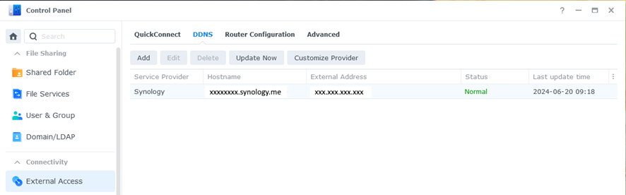
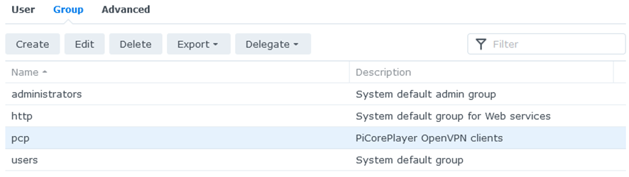
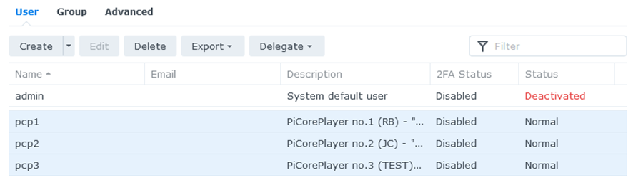
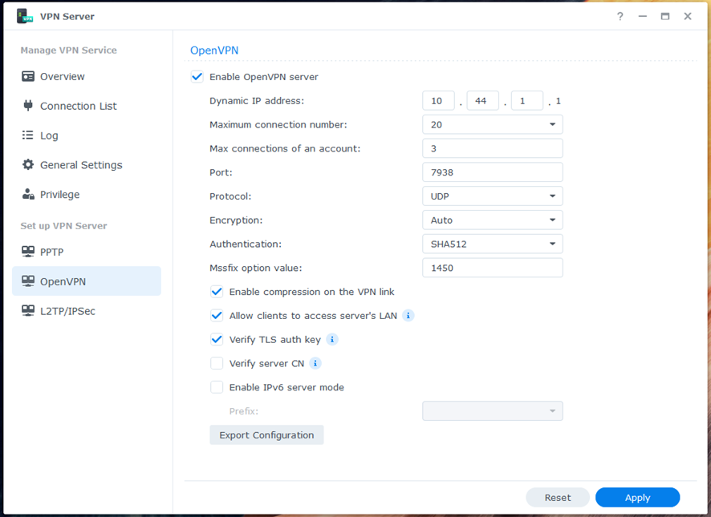
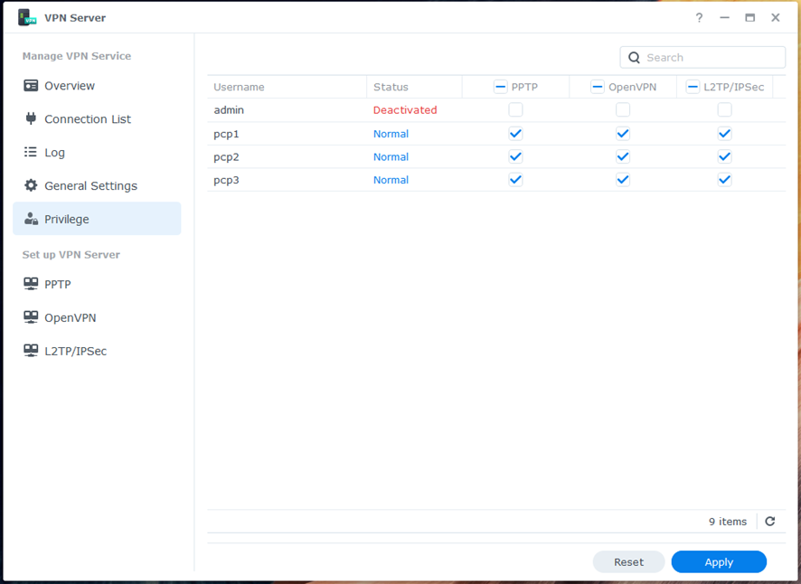

# OpenVPN - NAS
[Return to README](../README.md)

## Step 1: DDNS:  
- DDNS is a service that automatically updates your domain name to point to your home network, even when your internet provider changes your IP address.  

Step 1:  
  

## Step 2+3: User:  
Step 2: Group  
  
Step 3: User  
  

## Step 4+5: VPN Server:  
Step 4: OpenVPN  
  
Step 5: Privilege  
  