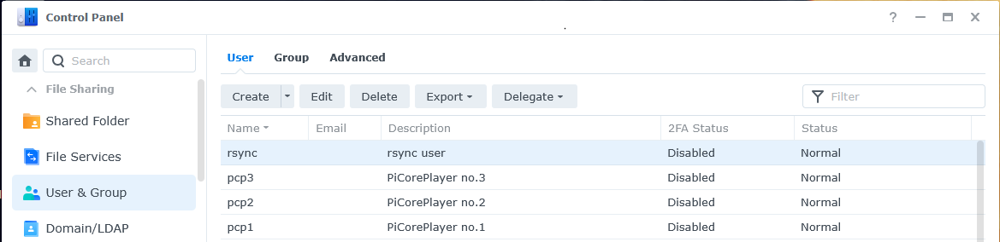
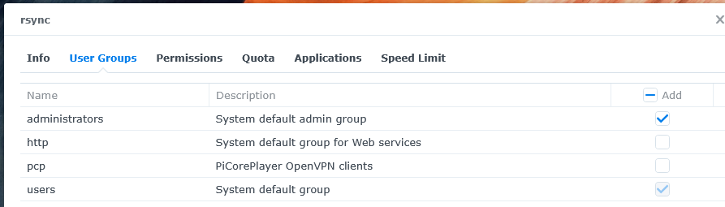
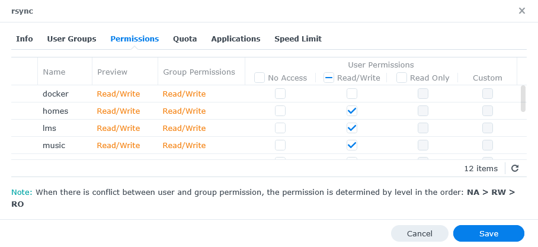
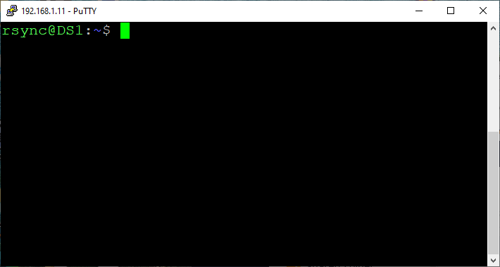
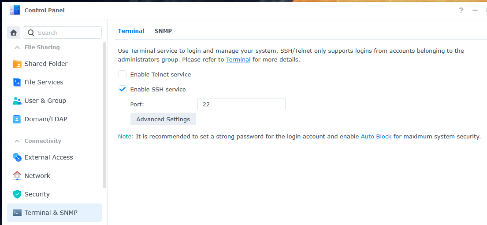

# rsync - NAS
[Return to README](../README.md)

## Gathering knowledge:
To understand how rsync works on a Synology NAS, I have found good information at the links below. (rigth click and "Open in a new Tap/Window") 
- **Synology forum:** How to enable SSH key authentication on Synology NAS, https://community.synology.com/enu/forum/1/post/136213  
- **YouTube:** Enable Key Based SSH Authentication For Synology Servers, https://www.youtube.com/watch?v=XN9SuzV08Ew  
- **YouTube:** Use a RaspberryPi as an Offsite / Remote Backup for your Critical Data!, https://www.youtube.com/watch?v=ffx4HhNLqfI  

## Step 1: NAS rsync User (DSM 7.x):
I have created a new user "rsync" on the NAS which is only used for rsync.  
The "rsync" user belongs to the Admin group (only Admins can SSH)  
Give the "rsync" user the desired Permissions  
  
* **Step 1a: Create NAS user**  (Control Panel -> User -> Create)   
  
  
* **Step 1b: Set User Groups** (Control Panel -> User -> rsync -> User Groups)
  
  
* **Step 1c: Set User Permissions** (Control Panel -> User -> rsync -> Permissions)  
  

## Step 2: NAS changes (SSH):
* **Step 2: Connect to the NAS with a ssh client**  (I use PuTTY) and login in with the rsync user creeated in Step 1.  
  

> * **Step 2a: "file: sshd_config"**  With Vim, edit the /etc/ssh/sshd_config file
```text
sudo vim /etc/ssh/sshd_config
```
> * **Step 2a: "file: sshd_config"**  In Vim, make these changes
```text
remove "#" before "PubkeyAuthentication yes"
remove "#" before "AuthorizedKeysFile .ssh/authorized_keys"
remove "#" before "ChallengeResponseAuthentication no"
```
> * **Step 2a: "file: sshd_config"**  In Vim, save the file
```text
:wq!
```
  
> * **Step 2b: "folder: .ssh"**  Create folder (in rsync user home folder)
```text
mkdir .ssh
```
> * **Step 2b: "folder: .ssh"**  Change folder permission to "drwx------"
```text
chmod 700 .ssh
```
  
> * **Step 2c: "file: authorized_keys"**  Create file in the .ssh folder 
```text
touch .ssh/authorized_keys
```
> * **Step 2c: "file: authorized_keys"**  Change file permission to "-rw-------" 
```text
chmod 600 .ssh/authorized_keys
```
  
> * **Step 2d: "folder: rsync homes folder"** Print rsync home folder (Print Working Directory) 
```text
pwd
```
> * **Step 2d: "folder: rsync homes folder"**  Go to homes folder 
```text
cd /var/services/homes
```
> * **Step 2d: "folder: rsync homes folder"**  Change folder permission to "drwx------" 
```text
sudo chmod 700  rsync
```
  
* **Step 2c: "activate"**  Activate the changes  
Control Panel -> Terminal and SNMP -> Terminal -> uncheck "Enable SSH service" -> Apply  
Control Panel -> Terminal and SNMP -> Terminal -> check "Enable SSH service" -> Apply  
  
  
## Step 3: Copy Key from RPi (pcpX) to NAS:  
In this step, an ssh key is copied from Raspberry Pi to NAS.  
The easiest way to do it is to open 2 SSH clients at the same time, pcpX in one and NAS in the other.  
A key must be copied for each pcpX that will use the rsync function.  
  
> * **Step 3a: "RPi (pcpX): Copy Key"**  Generate Key on RPi, Command creates a 4096 bit key  
```text
ssh-keygen -t rsa -b 4096
```
