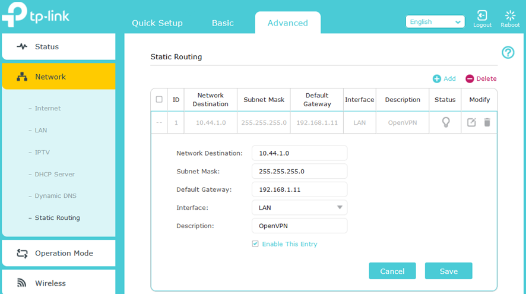
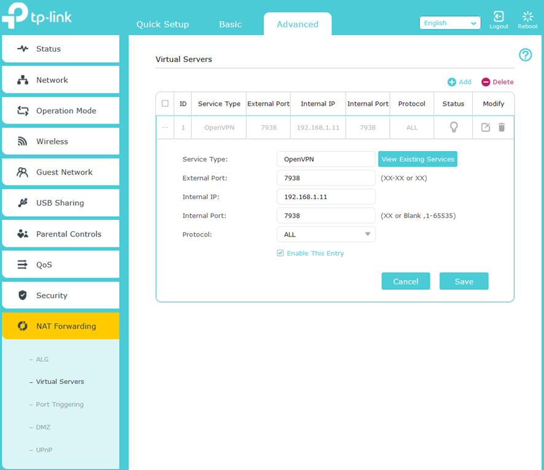

[Return to README](../README.md)  

# OpenVPN - Router  
Screendumps are from my router, the setup for another router will be similar  
My Router = TP-Link Archer AX50 v1.0 / 1.0.14 Build 20240108 rel.42655(4555)  

## Step 1: Static Routing  
A manual way to tell your router exactly which path to take to reach a specific network. Unlike automatic routing, these paths never change unless you manually update them. It is most commonly used to connect two different networks or to ensure traffic to a specific VPN server always goes through a certain gateway.  

- **Network Destination:** Remote network IP address (= pCP)   
- **Subnet Mask:** Remote network Subnet Mask  
- **Default Gateway:**  VPN server IP adresse (= NAS)  
- **Interface:** Physical connection the VPN server (= NAS)   
- **Description:** Name/Label   

Step 1: Static Routing  
  

## Step 2: NAT Forwarding  
A feature that allows devices on the internet to access a specific device or service inside your private home network. It acts as a map that directs incoming traffic from the outside directly to the correct computer, console, or server on the inside.  

- **Service Type:** Name/Label  
- **External Port:** External device Port number (= VPN Server port number)  
- **Internal IP:** Local device IP adresse (= VPN Server port number)  
- **Internal Port:** Local device Port number  (= VPN Server port number)  
- **Protocol:** Protocol used for the connection  

Step 2: NAT Forwarding  
  