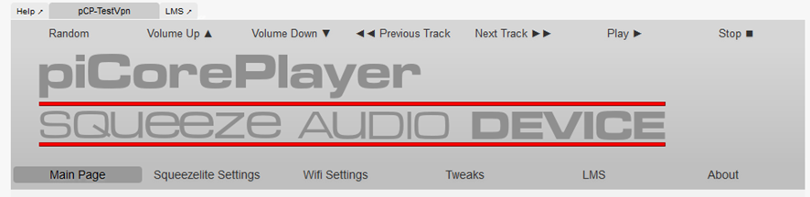

# pCP (PiCorePlayer) - Raspberry Pi 
[Return to README](../README.md)

## Install SD-Card:
Follow the instructions in the link below (rigth click and "Open in a new Tap/Window")  
[Install pCP SD-Card](https://docs.picoreplayer.org/getting-started/)
After "Step 3 - Boot piCorePlayer", follow the instructions below

## pCP webinterface, setup pages (IP: xxx.xxx.xxx.xxx):
pCP webinterface: Menu  
  

PiCorePlayer is used as both Player and Server

### Setup General:
- pCP system password = xxxxxx (safe password, I use the same on all remote pCP's)
- Do you want to check for updates? = Yes
- Set Hostname = pcpX (X = number)
- Enable SSH = Yes
- Enable NTP = Leave Default
- Select pCP Mode = Yes
- Select pCP Theme = Light
- pCP Repo = Next
- Audio Detection = Setup later on Squeezelite Page (Save)
- Resize SD card = 8000MB

### Main Page:
Install piCorePlayer extensions (Main Page -> Extensions -> main repository)
- nano.tcz  
- openvpn.tcz (for OpenVPN)  
- rsync.tcz  (for rsync)  

### Squeezelite Settings:
- Audio output device settings

### Wifi Settings:
- Wifi to mobile hotspot (only used for testing)

### Tweaks:
- Nothing

### Drives:
- Mount USB Disk = /mnt/hd
- Set USB Mount
- Set Write Permissions
- Install Samba for pCP
- Server Name = pcpX (X = number)
- Server WorkGroup = WORKGROUP
- Share Name = hd
- Share path = /mnt/hd
- Create File Mode = 0775
- User = tc, Password = xxxxxx (I use the same as, Setup General/piCorePlayer system password)
- Windows file browser = \\pcpX\hd

### Lyrion
- Install LMS
- Set Branch = Stable
- Start LMS
- Save LMS Server Cache and Preferences to Mounted Drive = USB Disk
- Move LMS Data
- BackUp + Reboot (Main Page)

## LMS webinterface (IP: xxx.xxx.xxx.xxx:9000):

### Lyrion Music Server
Start first time
Basic Settings
- Media Library Name: pcpX-lms
- set /mnt/hd/Music/Children
Set & Scan all Music drives + playlist folder (7 pcs.)
Plugins
- Additional Browse Modes
- Don't Stop The Music
- Drag & drop music files to play
- Find Artwork for Radio
- Full text search
- Material Skin
- Music and Artist Information
- Online Music Library
- Podcasts
- Presets Editor
- Radio
- Radio Now Playing
- RadioNet
- Random Mix
- Remote Music Libraries
- Report Analytics Data
- Song Scanner
- Sounds & Effects
- Visual Statistics
Behavior
Release types for Albums = Group an artist list by release type
Plugins – Material skin
Use comment for disc title = Contains only title

### Lyrion Music Interface
Color = For all players
Mobile layout now-playing bar = Thick
Font size = Large
Home screen items = afhængig af hvem der er bruger